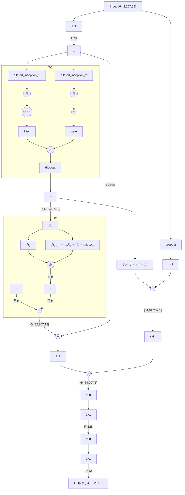

MTGNN结构图，尝试用mermaid实现并部署在个人blog上，算是近一周学习的总结

```mermaid[preview]

flowchart TB
    input["Input: [64,2,207,19]"] --> start_conv[1x1] --F=32-->x

    x --> dilated_inception_1
    x --> dilated_inception_2

    subgraph TC

    dilated_inception_1 --> cat1(("$$\oplus$$")) --> sig1(("$$\tanh$$")) --> filter
    dilated_inception_2 --> cat2(("$$\oplus$$")) --> sig2(("$$\sigma$$")) --> gate

    filter --> multi1(("$$\times$$")) --> dp1[dropout]

    gate --> multi1

    end

    dp1 --> x2[x]
    x2 --[64,32,207,13]--> x4[$$X_i$$]
    subgraph GC
    x4 --> H["$$H_i$$"] --> cat3(("$$\oplus$$")) --mlp--> x5[x]
    x4-->H2["$$H_{i+1}=\alpha X_i+(1-\alpha) A X_i$$"]-->cat3
    x6[x]--反向-->plus2
    end

    x5[x]--正向-->plus2((+))--[64,32,207,13]-->plus1

    x --residual--> plus1((+)) -->c0[1x1]-->plus5

    x2---->c["$$1 \times (T-rf+1)$$"]-->plus3--[64,64,207,1]--->skip-->plus5((+))

    input---->dp3[dropout] -->1x1-->plus3((+))

    plus5--[64,64,207,1]-->r1[relu]-->c2[1x1]--F=128-->r2[relu]-->c3[1x1]--F=12-->Output["Output: [64,12,207,1]"]

```
